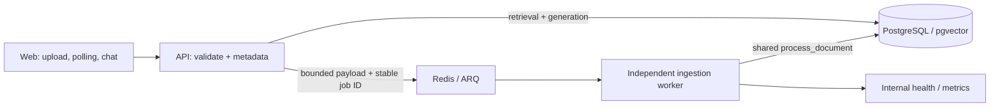

# Day 01 - Architecture and decisions

Nguồn: Specification v3.3 mục 5. Solution chuyển starter sync sang async ingestion. Base: `0d5b838776a5f1af01d737674d8fc85724c3c60f`; branch `day1-refactor`.

Trước refactor, request gọi `ingest_document_sync` và chỉ trả 201 khi embed/store xong. Sau refactor, API chỉ preflight nội dung, commit metadata và enqueue; trả 202 với `pending`, 0 chunks và ID mới. Worker xử lý độc lập rồi cập nhật cùng ID. Web polling và citations đã có, không tính là feature mới.

| Quyết định | Lý do và hệ quả |
|---|---|
| ARQ 0.28.0 + Redis 7 | Theo yêu cầu Day 01; hợp async Python, dùng lại stack nhỏ. Không cần Celery/broker mới. |
| Shared `process_document` | Giữ một implementation chunk/embed/store cùng row locks, savepoint, identity và vector checks. |
| `asyncio.to_thread` + shield/drain | DB/provider sync không chặn ARQ loop. Cancellation không thể tự dừng thread; phải chờ trước khi đóng pool. |
| Payload bytes trong Redis, giới hạn 10 MiB | Không thêm schema/storage service. Queue chứa dữ liệu tài liệu, chỉ chạy nội bộ; AOF và volume thuộc lab. |
| Giữ extract-text preflight ở API | Bảo toàn 422 cho PDF hỏng/text rỗng và failed metadata của baseline. Mốc <1s được đo trên workload cố định, không hứa mọi PDF. |
| Stable job ID `ingestion:{id}` | ARQ dedup active jobs; DB row lock/idempotency vẫn là bảo vệ cuối khi redelivery. |
| Automatic retry 1/2/4 giây | Tổng tối đa 4 attempts cho timeout/network/429/5xx. Lỗi vector/input/identity không retry. |
| Manual retry giữ cùng ID | Feature mới duy nhất: gửi lại đúng file cho failed document, so filename/hash/pipeline trước khi enqueue. |
| Retry `require_new=True` | Không nhận job cũ đang kết thúc thành retry mới. Lỗi mất phản hồi trả 503 an toàn; người dùng đọc lại trạng thái trước khi retry tiếp. |
| Docker restart: unless-stopped | Worker exit 1 với JSON safe code khi mất Redis; Docker restart theo backoff, xử lý job khi Redis sẵn sàng. Manual stop vẫn được giữ cho lab. |
| Web status recovery | Polling thử lại sau lỗi API, tối đa 60 lượt; refresh bắt đầu chu kỳ mới. Upload lỗi refresh metadata nhưng giữ thông báo gốc. |
| Worker health/metrics trong service | Giữ đúng 5 service; readiness kiểm Redis heartbeat + DB; metrics từ job thật, không thêm monitoring stack Day 04. |
| Mypy strict toàn runtime API + worker | Bổ sung typing tại boundary, không blanket-ignore/exclude để che type debt. |
| Nâng CI baseline sẵn có | Test worker/HTTP/quality của Day 01; không thêm deploy/OIDC/IaC Day 03. |

## Contract và trạng thái

- POST `/documents`: 202 sau queue acceptance; 400 extension; 413 vượt size; 422 invalid text/PDF; 503 queue unavailable. Preflight index/schema giữ contract lỗi cũ.
- GET `/documents`: shape giữ nguyên. `pending -> ready` hoặc `pending -> failed`; lỗi provider xảy ra sau 202 được quan sát qua `error_code`.
- POST `/documents/{id}/retry`: multipart file gốc, chỉ `failed`; 202 cùng ID. 409 nếu pending/ready/filename/hash/pipeline khác hoặc job cũ chưa kết thúc; 404 nếu ID thiếu. Size/validation tương đương upload.
- Retry tự động: pending trong các lần transient; failed + safe code khi hết 3 retries; không commit partial chunks. Worker không làm sống lại ID đã xóa.
- Chat/retrieval/source/usage contracts giữ nguyên. Fixture trả lời có nhãn, không được mô tả là real-model semantic evaluation.

## Giới hạn đã chấp nhận trong Day 01

PostgreSQL và Redis không có transaction chung. API có thể chết sau metadata commit trước enqueue, để lại pending; mất phản hồi enqueue cũng có thể làm API báo 503 trong khi worker đã nhận job. Không có claim exactly-once. Job payload expire sau 24 giờ; Redis persistence không thay backup. Recovery có kiểm tra từng ID tại [Runbook](Runbook.md), không thêm outbox/reconciler/schema ngoài phạm vi.

SIGTERM có thời gian drain 125s và Compose grace 150s; job timeout 120s. Đây là giới hạn cho lab, không bảo đảm hoàn tất mọi provider call dưới SIGKILL/OOM. Lỗi DB/network ngoài vùng transaction vẫn cần operator kiểm tra; Docker restart xử lý worker process exit; chưa có reconciler/DLQ/SLA production. Redis outage dài có thể tăng restart backoff; mốc ready <30s đo khi stack sẵn sàng và riêng một outage ngắn trong lab.

API/web bind loopback, worker/Redis không public port. Runtime dùng fixture, local Docker và không phát sinh AWS/API-provider charges. Chi phí điện/máy/coding subscription không được đo quy thành USD.
