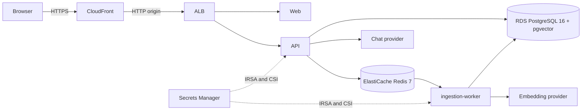

# Day 03 - Architecture and Decisions

## Deployment topology

Local Kubernetes uses the same web, API and worker templates plus PostgreSQL and Redis StatefulSets. AWS uses managed data services, so five components do not imply five application pods.

## Decisions

| Decision | Reason and consequence |
|---|---|
| Separate bootstrap, core, platform and edge roots | Avoids provider dependencies before EKS/ALB exist and gives each owner a distinct state key |
| S3 native lockfile | Meets Terraform >=1.10 contract without introducing deprecated DynamoDB locking |
| Stable AZ IDs | Avoids account-specific AZ name remapping |
| Private nodes and data subnets | DB/cache remain private; one NAT Gateway is an explicit lab cost and availability trade-off |
| RDS and ElastiCache managed services | Meets Day 03 production topology; local StatefulSets remain a reproducible lab substitute |
| RDS-managed master password | Avoids a static password in Terraform configuration; runtime secret value is populated outside state |
| IRSA plus Secrets Store CSI | Application pods receive only the application secret; node role does not receive that permission |
| Separate GitHub plan/apply roles | Planning and deployment have different trust subjects and customer-managed policies |
| Private S3 saved plan | Raw Terraform plans can contain sensitive values and are not public Actions artifacts |
| Helm values for local/dev/staging | One chart preserves application contracts while changing data-service and secret providers |
| CloudFront default certificate for the lab | Supplies trusted HTTPS without purchasing or assuming a domain; an owned domain and ACM certificate remain an environment upgrade |
| Single Redis node in dev | Minimizes the short-lived lab bill; staging retains two nodes and automatic failover to demonstrate the resilient topology |
| Provider credentials in Secrets Manager | GitHub passes provider JSON once; pods consume the synced Kubernetes Secret |

## Security boundaries

- Public traffic reaches CloudFront on HTTPS; CloudFront forwards only the required methods to the ALB origin.
- API and web Services are internal ClusterIP resources.
- RDS and Redis security groups accept only the EKS workload security group.
- EKS public endpoint accepts reviewed admin CIDRs and also has private access.
- GitHub OIDC trust binds the exact repository and protected environment.
- Application IRSA trust binds `system:serviceaccount:insighthub-<env>:insighthub`.
- Checkov covers generic AWS misconfiguration; TFLint covers Terraform/AWS conventions; Conftest enforces project tags, encryption and network rules.

## Known limits

- The lab runtime currently builds its application database URL from the RDS-managed administrator secret. The secret is scoped through IRSA and never enters Terraform state, but a separate PostgreSQL application role would be a production hardening task outside the Day 03 requirements.
- ElastiCache uses TLS, encryption and private security groups without an auth token because a token value would enter Terraform state. Production should use IAM authentication or a separately rotated token after validating the pinned ARQ client path.
- The default CloudFront hostname is temporary evidence, not a production domain. Custom DNS, a custom certificate, WAF and origin TLS are production hardening outside Day 03.
- The local lab uses fixture LLM/embedding providers to verify system contracts. It does not attest model quality or Gemini connectivity.
