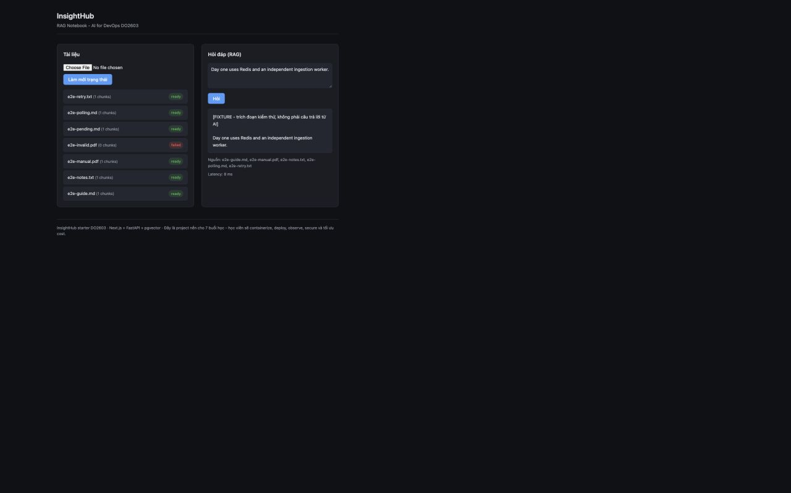

# Day 01 - Computer Use & Control Browser E2E

Ngày 17/09/2026, khoảng 16:36-16:45 ICT. Project `insighthub-day1-final-0917`, web `http://localhost:13001`, Swagger `http://localhost:18001/docs`. Application/providers fixture. Computer Use thao tác accessibility/Playwright locators, file chooser thật và nút Execute trong Swagger.

**11/11 cases PASS. Ba lỗi worker/UI đã được kiểm chứng khắc phục trên build cuối.** [File hashes](browser-fixtures.json), [screenshots và timestamps](browser-screenshots.json), [source binding](../../../evidence/day1.json). Các ảnh cùng build đã sửa; không dùng HTTP scripts thay cho thao tác browser.

| Case | Thao tác và kết quả thực tế | Evidence |
|---|---|---|
| E2E-01 | Upload `e2e-guide.md`, ID 10 ready với 1 chunk | [Ready/chat](browser-chat-ready.png) |
| E2E-02 | Stop worker, upload `e2e-pending.md`, ID 14 pending; sau start worker UI tự chuyển ready. Chu kỳ polling được khởi động lại trong phép thử timeout E2E-11 trước khi start worker | [Pending](browser-worker-paused.png), [ready](browser-worker-recovered.png) |
| E2E-03 | Hỏi nguyên văn nội dung mẫu; có answer FIXTURE và source chứa file tương ứng | [Chat](browser-chat-ready.png) |
| E2E-04 | Upload TXT/PDF, IDs 11/12 ready, mỗi file 1 chunk. Reload cuối giữ nguyên danh sách | [Ba định dạng](browser-three-formats.png), [reload/chat cuối](browser-final-chat.png) |
| E2E-05 | File 10 MiB + 1 byte và file rỗng bị từ chối. PDF hỏng có thông báo đúng, không ready giả | [Oversize](browser-oversize-rejected.png), [empty](browser-empty-rejected.png), [invalid PDF](browser-invalid-pdf.png) |
| E2E-06 | Ngắt Redis khi worker còn chạy; upload `e2e-retry.txt` tạo ID 16 failed. Chỉ start Redis, Swagger retry nhận 202 cùng ID và ready 1 chunk. Không start worker thủ công | [Failed](browser-queue-failure.png), [202](swagger-retry-202.png), [ready](browser-retry-ready.png), [automatic restart](worker-recovery.json) |
| E2E-07 | Swagger retry ID 16 đã ready trả 409; ID 999999 không tồn tại trả 404 | [409](swagger-retry-409.png), [404](swagger-retry-404.png) |
| E2E-08 | Worker dừng nhưng chat trên tài liệu ready vẫn hoạt động | [Worker paused và chat](browser-worker-paused.png) |
| E2E-09 | Upload ID 15 pending, dừng API tới khi hiện lỗi polling. Chỉ start API: lỗi kết nối tự xóa, vẫn pending. Start worker: tự ready, không bấm refresh. Lỗi upload file rỗng trong khi pending vẫn được giữ | [API down](browser-api-outage.png), [API up/pending](browser-api-recovered-pending.png), [ready](browser-api-recovered-ready.png) |
| E2E-10 | Upload invalid PDF khi không còn pending: ID 13 failed tự xuất hiện, thông báo lỗi gốc được giữ. Tương tự khi Redis không khả dụng với ID 16 | [PDF failed](browser-invalid-pdf.png), [queue failed](browser-queue-failure.png) |
| E2E-11 | Worker dừng tới khi hết 60 lần polling: UI báo dừng và hướng dẫn refresh. Bấm refresh khi ID 14 vẫn pending: chu kỳ tự cập nhật được bật lại. Start worker, UI tự ready | [Giới hạn](browser-polling-limit.png), [refresh/rearm](browser-polling-resumed.png), [ready](browser-worker-recovered.png) |

## Đối chiếu ba lỗi recovery

| Finding | Nguồn gốc | Kết quả sau sửa |
|---|---|---|
| Worker exit khi Redis mất kết nối, không tự chạy lại | Implementation Day 01 | `restart: unless-stopped`, safe JSON khi exit; probe và E2E-06 xác minh automatic recovery |
| Polling ngừng sau một lỗi API | Starter UI | Tiếp tục thử trong giới hạn; lỗi polling riêng với lỗi upload; E2E-09 và E2E-11 đạt |
| Failed metadata chưa hiện sau upload lỗi | Starter UI | Refresh danh sách trên nhánh lỗi, giữ thông báo ban đầu; E2E-10 đạt |

Sau reload cuối, chat trả FIXTURE answer đúng nội dung và nguồn, latency hiển thị 8 ms; [console cuối](browser-console.json) không có warning/error được ghi nhận. Fixtures nhỏ có sẵn ở `tests/milestones/day1/fixtures/`; file oversize tạo theo [Runbook](../../day1/Runbook.md).

Fixture kiểm chứng pipeline và source contract, không chứng minh chất lượng hiểu ngữ nghĩa của model thật. Fault injection chỉ tác động project lab được chọn; stack đã khôi phục healthy trước khi kết thúc kiểm thử.

