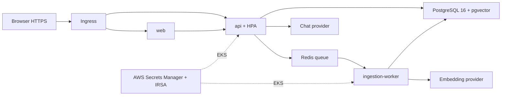

# Day 03 - Kế hoạch triển khai IaC và CI/CD

**Trạng thái:** Đã duyệt; local implementation hoàn tất, cloud acceptance chờ đầu vào. **Lớp:** DO2603. **Ngày:** 22/09/2026.
**Baseline:** `main` tại `ee6e16849ade9e1181b25128b2c9a63157768e06`.
**Branch:** `day3-terraform`. **PR dự kiến:** `[Day 3] Provision and deploy InsightHub with Terraform and GitHub Actions`.

Mục tiêu là xây solution Day 03 để học viên tái lập hạ tầng, pipeline và deployment từ source đã hoàn thiện Day 01-02. Nguồn yêu cầu: [Specification v3.3, mục 0, 4 và 7](../../Running-Project-Specification-Student.md), [lab Day 03](../lab-guides/Day3-AI-IaC-Pipeline.md), [guide local/AWS](../Guide_Local_AWS_Cost_DO2603.md) và [verification contract](../../scripts/VERIFICATION_CONTRACT.md).

## 1. Kết quả khảo sát và phạm vi

| Hạng mục | Hiện trạng đã kiểm tra | Phần cần hoàn thiện |
|---|---|---|
| Application | Năm thành phần Compose; ingestion async, retry, health/readiness và metrics đã có | Đóng gói deployment Kubernetes, giữ contract và schema |
| Terraform | `infra/` hiện có schema SQL và manifests MCP Day 02, chưa có `.tf` | SPEC, backend, modules, variables/outputs, policy và tests |
| CI/CD | `starter.yml` kiểm thử baseline và Compose | Bổ sung `iac.yml`, AWS OIDC, cost, approval, build/scan/deploy |
| Kubernetes | Day 02 có namespace `insighthub` và mẫu RBAC, chưa có Helm chart application | Namespace `insighthub-dev`, chart dùng được cho local và EKS |
| Toolchain | Terraform 1.15.6 trên máy; có Helm, kubectl, AWS CLI, GitHub CLI, Docker | Khóa toolchain; tflint, Checkov, Conftest, Infracost và kind chưa thấy trên PATH |
| Repository | GitHub repository public; Day 02 đã merge vào main | Pipeline phân biệt code tin cậy và PR ngoài; báo cáo công khai không chứa secret/state/raw plan |
| AWS | Chưa có EKS/VPC và domain được cung cấp cho lượt này | Chuẩn bị checklist đầu vào và dựng lab riêng khi đủ điều kiện |

Phạm vi gồm **14 Must-have**, toàn bộ functional/non-functional acceptance của mục 7, và năm Should-have: Conftest, Infracost comment, workspace dev/staging, AI giải thích plan trong PR, approval gate cho production. Conftest tuy nằm trong Should-have vẫn là acceptance bắt buộc của mục 7.5.

Chọn modular Terraform để đạt mục tiêu tái sử dụng và rubric L4. Bổ sung thiết kế retention RDS 7 ngày cho production trong tài liệu; chỉ triển khai môi trường lab `dev`. `staging` được validate/plan, không dựng đồng thời chỉ để minh họa workspace. Không thiết lập production thật hoặc lịch drift detection. Observability dashboard/alerts, Slack bot, LiteLLM và Promptfoo thuộc các day sau.

Tài liệu và tên tài nguyên dùng ngữ nghĩa dự án: `insighthub`, `insighthub-dev`, `insighthub-staging`, `terraform-registry`. Tên day chỉ dùng cho branch, bài học, kiểm thử milestone và evidence.

## 2. Kiến trúc được đề xuất

### 2.1. Local trước, AWS sau



| Thành phần | Local Kubernetes | AWS lab |
|---|---|---|
| Cluster | kind riêng cho deployment lab | EKS + managed node group trong VPC riêng |
| Ingress/TLS | Traefik qua Helm, CA lab và certificate đúng hostname | AWS Load Balancer Controller, ALB HTTPS, ACM và DNS |
| Application | Cùng chart, Deployments web/api/ingestion-worker | Cùng chart, image digest từ ECR |
| Database | PostgreSQL/pgvector StatefulSet và PVC cho lab | RDS PostgreSQL 16, encrypted, private, TLS |
| Queue | Redis 7 StatefulSet/PVC, AOF và noeviction | ElastiCache Redis OSS 7, cluster mode disabled, TLS và authentication |
| Secrets | Secret local sinh lúc setup, nằm ngoài Git | Secrets Manager qua AWS ASCP/Secrets Store CSI và IRSA |
| Scaling | API HPA và metrics-server được kiểm tra local | API HPA với requests/limits và metrics-server |

AWS vẫn có năm thành phần logic; PostgreSQL và Redis managed không phải hai pod của application. Local dùng dữ liệu mẫu tái tạo được. Workload fixture đo contract và mốc thời gian; workload real model chạy riêng và ghi latency thực, không trộn hai kết quả.

### 2.2. Phân chia Terraform và quyền sở hữu

| Root/module | Trách nhiệm | State/lifecycle |
|---|---|---|
| `infra/bootstrap/` | S3 state/plan storage, encryption, versioning, public-access block, GitHub OIDC và roles ban đầu | Bootstrap bằng phiên SSO/STS; state riêng, xử lý cuối khi teardown |
| `infra/` | Ghép modules network, eks, database, cache, iam, secrets và registry | S3 backend, `use_lockfile=true`; workspace dev/staging tách state |
| `infra/platform/` | Kubernetes namespace, application ServiceAccount `insighthub`, RBAC và identities hỗ trợ deployment | Chỉ plan/apply sau khi EKS endpoint tồn tại và runner truy cập được; key state riêng |
| `deploy/helm/insighthub/` | Deployment/Service/HPA/Ingress/ConfigMap/SecretProviderClass và bootstrap DB Job | Helm quản lý workload; AWS values dùng namespace/SA do Terraform tạo |

Tách AWS root và Kubernetes root để không khởi tạo Kubernetes provider trước khi cluster tồn tại. Không dùng `-target` làm quy trình triển khai thường xuyên. Local values cho phép chart tạo namespace/SA local; AWS values tắt phần đó để tránh hai công cụ cùng sở hữu resource.

Backend bootstrap không tự phụ thuộc bucket mà nó đang tạo. Quyền S3 có phạm vi theo state key/workspace và lockfile; lockfile được phép delete, state không cần quyền delete thường xuyên. State, saved plan và JSON plan có thể chứa secret dù biến đánh dấu `sensitive`, nên chỉ lưu ở vị trí private có kiểm soát. [S3 backend chính chủ](https://developer.hashicorp.com/terraform/language/backend/s3).

### 2.3. Network, data và secrets

- VPC có public subnets cho ALB và private subnets cho nodes/data, phân bố tối thiểu hai AZ. Dùng egress cần thiết cho registry, AWS APIs và model APIs; dự toán cả NAT/EIP/data transfer. Không mở PostgreSQL/Redis ra internet.
- Security groups chỉ cho application nodes/pods và DB bootstrap truy cập đúng port. EKS bật private endpoint; public endpoint, nếu dùng cho máy lab, chỉ nhận CIDR quản trị/runner đã khai báo.
- PR static jobs chạy GitHub-hosted. Jobs thao tác Kubernetes dùng runner tạm thời trên máy lab có đường tới endpoint và IP đã biết, chỉ nhận workflow của repository/ref đã review. Không đưa PR không tin cậy lên runner này. Không xây thêm nền tảng quản lý runners.
- RDS pin PostgreSQL 16 minor và pgvector extension được AWS hỗ trợ tại region thực hành. Bootstrap Job chạy nguyên schema `infra/db/init.sql`. Trong phạm vi lab Day 03, pipeline tạo runtime URL từ RDS-managed credential và chỉ application IRSA đọc application secret; tách PostgreSQL application role là hardening production ngoài requirement. [RDS extension matrix](https://docs.aws.amazon.com/AmazonRDS/latest/PostgreSQLReleaseNotes/postgresql-extensions.html).
- RDS master password do RDS quản lý trong Secrets Manager. Application secret chứa credential/URL runtime và provider settings; API/worker chỉ đọc secret này. Không đưa secret value vào Terraform state. [RDS password management](https://docs.aws.amazon.com/AmazonRDS/latest/UserGuide/rds-secrets-manager.html).
- IRSA trust ràng buộc đúng cluster issuer, namespace, ServiceAccount và audience. Dùng AWS ASCP/Secrets Store CSI với volume mount và secret sync để cấp env vars hiện có; kiểm tra cold start từ namespace chưa có Secret. Node role không nhận quyền đọc application secrets. [AWS ASCP với IRSA](https://docs.aws.amazon.com/secretsmanager/latest/userguide/integrating_ascp_irsa.html).
- RDS client dùng CA phù hợp và hostname verification. Redis dùng `rediss://`, TLS và security-group isolation; giữ ARQ queue/key semantics. Auth token không được đưa vào Terraform state; IAM authentication/token rotation là hardening sau khi xác minh compatibility của ARQ đã pin. [RDS TLS](https://docs.aws.amazon.com/AmazonRDS/latest/UserGuide/PostgreSQL.Concepts.General.SSL.html), [ElastiCache TLS](https://docs.aws.amazon.com/AmazonElastiCache/latest/dg/in-transit-encryption.html).
- ElastiCache không thay thế nguyên trạng tính bền vững AOF của Compose; tài liệu nêu rõ đặc tính persistence/failover đã chọn và recovery cho pending jobs. Không tuyên bố exactly-once hoặc không mất job khi chưa có bằng chứng.
- Mỗi workload có startup/readiness/liveness probes đúng endpoint, requests/limits, non-root security context và shutdown grace phù hợp worker 125 giây. API HPA không tự chuyển sang autoscale worker bằng queue, vì đó chưa phải yêu cầu Day 03.
- Ingress giữ `/` về web, `/api/*` của Next.js về web, và các route API cần nghiệm thu như `/healthz`, `/readyz`, `/documents`, `/chat` về API. Không public `/metrics` hoặc worker monitor. Giữ timeout/body-size đủ cho contract upload và chat, kiểm chứng lỗi 413 qua ingress.

### 2.4. MCP và công cụ chính chủ

Tiếp tục dùng Filesystem, Docker và Kubernetes MCP Day 02 để đọc kiến trúc, container/pod/events/logs. Namespace `insighthub-dev` cần RoleBinding/kubeconfig đọc riêng; không mở rộng token Day 02 thành cluster-admin. CLI/pipeline chịu trách nhiệm apply; MCP phục vụ tìm hiểu và kiểm chứng.

Đề xuất thêm **HashiCorp Terraform MCP**, tên `terraform-registry`, chỉ bật toolset `registry` để tra provider/module documentation trong lúc viết IaC. Pin release/checksum hoặc image digest; không cấp AWS credentials, HCP token hay mount state. Đây là công cụ hỗ trợ có thể bỏ nếu không cần, không thêm điều kiện chấm Day 03 và không viết MCP server riêng. [Terraform MCP reference](https://developer.hashicorp.com/terraform/mcp-server/reference).

Nếu sử dụng, bổ sung entry vào generator/templates hiện có cho Codex, Claude và Antigravity, giữ config project ngoài Git. Không tạo ba bộ definitions độc lập, không thay MCP backend Day 02 chỉ để phục vụ Day 03.

## 3. Đầu vào cần bổ sung trước bước AWS

Theo xác nhận hiện tại, plan không giả định đã có EKS/VPC/domain. Các bước SPEC, source, tests và local deployment có thể hoàn thiện trước các đầu vào sau.

| Đầu vào | Dùng để | Điều kiện chốt |
|---|---|---|
| AWS sandbox account, region, SSO/STS profile | Bootstrap, plan và cloud verification | Identity được đối chiếu; không dùng production hoặc admin mặc định |
| Owner, `cost_center`, lab ID, thời điểm hết hạn | Tags, inventory và cleanup | Có đủ tags chuẩn và tags vận hành lớp |
| Budget USD/lượt và thời lượng tối đa | Cost gate và giới hạn thời gian AWS | Được chốt sau dự toán theo region, trước apply |
| Quyền bootstrap IAM/S3/EKS và quotas | Tạo remote state, trust và lab resources | Quyền giới hạn đúng lab; đủ quota nodes/RDS/Redis/IP |
| Domain/subdomain và quyền DNS hoặc ACM certificate phù hợp | HTTPS endpoint thật | Không mua domain hoặc dùng hostname mẫu làm live evidence |
| Reviewer và GitHub Environments | Manual approval | Có người review plan; người tạo run không tự bypass gate |
| Runner lab, CIDR/đường mạng tới EKS | Kubernetes Terraform/Helm trong pipeline | Thử DNS/TLS/connectivity trước lượt deploy; không dùng allowlist `0.0.0.0/0` |
| Infracost credential phù hợp bản pin | Dự toán và PR comment | Cấp qua secret store; xác minh integration theo tài liệu phiên bản |
| Model credentials/config dùng cho real-model smoke | Upload/chat thực với provider hiện có | Hai model chat/embedding rõ ràng, vector dimension vẫn 1024 |

Không cần gửi credential trong hội thoại. Giá trị nhạy cảm được cấu hình qua SSO, Secrets Manager hoặc GitHub Secrets phù hợp.

Trước apply phải có `lab-manifest.json`: account, region, workspace/state, owner, lab ID, started/expires timestamps, budget, resource inventory và reviewer. Dự toán tách monthly baseline của Infracost với **chi phí lượt lab**, cộng thời gian provision/test/idle/teardown, EKS/nodes, RDS, Redis, storage/snapshot, ALB, NAT/IPv4, registry, secrets, telemetry và model calls. Không suy chi phí lượt chỉ bằng chia mọi khoản monthly cho 730.

## 4. Ma trận yêu cầu và bằng chứng

| ID | Hạng mục triển khai | Kết quả dự kiến và bằng chứng |
|---|---|---|
| MH1 | `infra/main.tf`, `variables.tf`, `outputs.tf`, `providers.tf` và modules | Init/validate thành công; README giải thích input/output |
| MH2 | `infra/backend.tf`, bootstrap, state keys/workspaces | S3 init thành công; test cạnh tranh lock trên state lab riêng chứng minh native locking |
| MH3 | Namespace Terraform `insighthub-dev` | Resource trong platform state và namespace thật trên EKS |
| MH4 | RDS PostgreSQL 16, encrypted/private và schema bootstrap | Plan + AWS describe + SQL extension/schema probe; app connect bằng TLS |
| MH5 | ElastiCache Redis OSS 7 trong private subnet | Plan + AWS describe + queue/worker round trip có TLS/auth |
| MH6 | ServiceAccount `insighthub`, IAM role và trust chính xác | Annotation, STS identity trong pod, đọc secret được phép và deny secret ngoài scope |
| MH7 | `.github/workflows/iac.yml` | Workflow syntax hợp lệ, Actions nhận diện được |
| MH8 | Jobs fmt, lint, security-scan, policy-check, plan, cost-estimate, apply | DAG đủ jobs; apply phụ thuộc tất cả gates và approval |
| MH9 | Pipeline PR green trên đúng source | URL PR/run, SHA/fingerprint và source-manifest; kèm deploy run thật |
| MH10 | Helm chart, local/AWS values | Helm release deployed; web/api/ingestion-worker Ready; DB/cache probe riêng |
| MH11 | Smoke HTTP + Computer Use browser | HTTPS health 200; upload 202; đúng document ID ready; chat 200 có answer/citations |
| MH12 | TFLint và AWS ruleset đã pin | `tflint --recursive` không error/warning |
| MH13 | Checkov source/plan và report | Không HIGH/CRITICAL; mọi finding có disposition hợp lệ, không blanket skip/soft-fail |
| MH14 | Tags standard và inventory | `project`, `environment`, `owner`, `cost_center`, `managed_by`; thêm `Class`, `LabId`, `Owner`, `ExpiresAt` theo guide; resource không hỗ trợ tags được liệt kê theo ID |
| SH1 | Rego tags/encryption/cost guardrails | Positive/negative tests và Conftest trên plan thực |
| SH2 | Infracost comment | PR comment chứa diff/cost, assumptions và phần chưa được tool định giá |
| SH3 | Workspaces dev/staging và values tương ứng | State tách biệt, validate/plan cả hai; chỉ dev được apply trong lab |
| SH4 | AI giải thích sanitized plan | PR comment chỉ ra create/change/destroy, IAM/network và chi phí; có human review |
| SH5 | Protected GitHub Environment cho apply, cấu hình production gate | Evidence run chờ approval rồi mới assume apply role; production không triển khai |
| Chung | SPEC, prompt pack, self-check, source binding, cleanup | Đủ artifacts; checklist có evidence; không dùng verifier PASS thay nghiệm thu toàn phần |

## 5. Pipeline và policy gates

### 5.1. Thứ tự thực thi

```text
fmt -> lint -> security-scan -> policy-check -> plan -> cost-estimate
                                |              |
                                |              +-- Conftest trên tfplan.json thực
                                +-- Rego tests / kiểm tra policy trước plan

build matrix(web, api, worker) -> tests + image scan + Helm/local smoke

hai nhánh trên thành công -> human review -> protected apply
    -> AWS resources -> platform plan + policy + review -> platform apply
    -> push images theo digest -> DB bootstrap -> Helm deploy -> E2E
    -> thu evidence -> teardown + inventory
```

Policy trước plan kiểm tra rules và input có sẵn; policy sau plan mới đánh giá cấu hình tài nguyên thực, kể cả nested modules và unknown values. Tên và thứ tự jobs theo specification được giữ, nhưng `plan` phải chạy Conftest trước khi được coi là thành công. `apply` chỉ nhận saved plan đã vượt policy và budget gate.

Lượt tạo cluster đầu tiên cần hai plan/apply độc lập: AWS trước, Kubernetes sau. Không ghi platform plan bằng mock thành plan EKS thật. Khi cluster đã có, chạy lại PR verification để thu đủ bằng chứng trước teardown.

### 5.2. Trust, approval và artifact

- PR ngoài/fork chỉ chạy static checks và local tests, không nhận AWS role, state hoặc model secrets. Không chạy code PR qua `pull_request_target` có quyền ghi. PR trong repository đã được review mới chạy AWS plan dưới identity được kiểm soát.
- Phân biệt plan role và apply role; plan role chỉ đọc resource/state, cộng quyền lockfile và prefix artifact cần thiết. Apply role giới hạn service/resource/tag/`iam:PassRole` đúng lab. Có negative tests đối với repo/ref/environment không được phép.
- OIDC kiểm tra audience và `sub` theo cấu hình repository thực, không copy subject wildcard. Khi gắn environment, trust dùng đúng environment subject và branch restrictions. Đọc format subject hiện hành trước khi bootstrap, kể cả trường hợp GitHub dùng immutable IDs. [GitHub OIDC/AWS](https://docs.github.com/en/actions/how-tos/secure-your-work/security-harden-deployments/oidc-in-aws).
- Apply có GitHub Environment required reviewer và evidence thời điểm approve; `workflow_dispatch` tự nó không chứng minh manual approval. Repository public hiện hỗ trợ cấu hình required reviewers theo các gói GitHub hiện hành. [Deployment protection](https://docs.github.com/en/actions/reference/workflows-and-actions/deployments-and-environments).
- PR run có thể green với apply bị skip theo thiết kế; phải thu thêm deploy run đã apply và smoke thành công. Trong lần học trên branch, environment cho phép đúng `day3-terraform`; không tự merge main để kích hoạt deployment.
- Workflow mới chưa có trên default branch không thể chỉ dựa vào `workflow_dispatch`. Lượt nghiệm thu đầu dùng sự kiện `pull_request` với opt-in label `lab-deploy` do maintainer gắn, kiểm tra đúng repository/branch và vẫn chờ protected-environment approval. Các lần synchronize chỉ validate, không tự apply vì label còn tồn tại. Sau khi workflow được merge, mới dùng dispatch như đường vận hành bổ sung. [GitHub workflow events](https://docs.github.com/en/actions/reference/workflows-and-actions/events-that-trigger-workflows).
- Plan, apply và destroy dùng concurrency cùng environment/state, không hủy apply đang chạy. Saved plan ràng buộc commit/source hash, root/workspace/account/region, toolchain và checksum; plan stale hoặc nguồn thay đổi phải plan/review lại.
- Raw plan/binary/state chỉ lưu private, encrypted, TTL ngắn; không upload thành Actions artifact public. Chỉ upload report đã làm sạch, image/chart metadata và `verification-source/source-manifest.json` không chứa credential.
- Actions pin commit SHA, providers có `.terraform.lock.hcl`, modules/chart/tools pin phiên bản và checksum/digest phù hợp. Cache theo lockfile/platform; không cache secret hoặc state.
- Dùng integration Infracost đúng phiên bản pin, xác minh command và credential thực tế trước khi viết workflow; không mặc định snippet cũ còn tương thích. Báo cáo source HCL và plan đã làm sạch phải cùng environment/region. [Infracost Actions](https://www.infracost.io/docs/integrations/github_actions/).

### 5.3. Policy phải bắt được gì

| Nhóm | Quy tắc và negative case |
|---|---|
| Tags | Thiếu hoặc rỗng tag chuẩn; phân biệt resource có/không hỗ trợ tags |
| Network | RDS public, data subnet public, DB/Redis ingress rộng, EKS admin CIDR quá rộng |
| Encryption | Tắt RDS/cache encryption, TLS hoặc dùng endpoint không xác minh certificate |
| IAM/secret | Trust sai scope, quyền application đọc master/secret ngoài scope, credential hardcode |
| Chi phí | Region/SKU/storage/replica ngoài allowlist, thiếu TTL/budget hoặc dự toán vượt budget lượt |
| Lifecycle | Unexpected destroy/replace; apply sai workspace/account; plan khác source hoặc checksum |

Rego phải phân biệt giá trị unknown với giá trị an toàn, có test nested modules và từng negative case. Infracost tính tiền; Rego kiểm tra topology/budget input, không tự bịa bảng giá AWS.

Checkov mặc định fail khi còn finding chưa xử lý. Không coi thiếu severity metadata là LOW. Chỉ chấp nhận exception cụ thể khi có lý do, bằng chứng không phải HIGH/CRITICAL và reviewer xác nhận; không thêm `--soft-fail` hoặc skip toàn framework để pipeline xanh. Verifier chạy Checkov với exit code chặt hơn mô tả no-HIGH, nên phải đạt cả contract đó. Scan fixtures Day 02 phải được xác định đúng vai trò lab; không sửa behavior Day 02 hoặc verifier để né gate.

## 6. Các bước triển khai và kết quả dự kiến

| Bước | Công việc | Điều kiện chuyển bước |
|---|---|---|
| 1. SPEC và review | Viết `infra/SPEC.md`: mục tiêu, input/output, topology, trust, state, cost, lifecycle, acceptance. Cập nhật context Day 01-03 và prompt pack | Plan/SPEC đã review; mọi thay đổi gắn requirement |
| 2. Toolchain và IaC | Khóa tools/providers; viết bootstrap + modules + platform root, example vars, tags và policies/tests | fmt/validate/TFLint/Checkov/Conftest tests đạt; chưa apply AWS |
| 3. Helm local | Viết chart và values local/dev/staging; bootstrap SQL; probes/security/resources/HPA/ingress; chạy local fixture rồi real model | Local HTTPS + upload/ready/chat và Computer Use E2E đạt |
| 4. Pipeline | Viết iac.yml, image matrix/cache/scans, source binding, cost/plan comments và approval rules | Workflow lint và local stages đạt; cloud stages có đầu vào thật, không stub PASS |
| 5. Bootstrap cloud | Kiểm tra account/region/quotas/domain/runner; tạo manifest, cost estimate và remote state/trust bằng phiên ngắn hạn | OIDC được verify, cost/timer chốt, reviewer nhìn thấy plan thật |
| 6. AWS deployment | Apply saved AWS plan; sau cluster readiness, plan/review/apply platform; cài controller/CSI; push images, bootstrap DB và deploy Helm | Namespace/IRSA/secrets/RDS/Redis/web/api/worker thực sự chạy đúng contract |
| 7. Nghiệm thu | PR pipeline green; HTTP smoke, Computer Use E2E cloud; negative permission tests; fresh plan không có drift ngoài dự kiến | Đủ evidence cho MH/SH và source binding; findings trong Day 03 đã xử lý |
| 8. Teardown và bàn giao | Thu report; dọn ingress/LB rồi workloads/platform/data/cluster/network/bootstrap theo ownership; rà inventory; chuẩn hóa commits/runbook/self-check | Không còn resource lab tính phí ngoài retention đã duyệt; final source và evidence nhất quán |

Hai lần human review kỹ thuật nằm trong quy trình học viên: review SPEC/thiết kế trước code và review diff/plan/cost trước apply. Policy gate bổ sung kiểm tra tự động; không thay hai bước review này.

## 7. Kế hoạch kiểm thử và E2E

| Lớp kiểm thử | Ca kiểm tra chính | Tiêu chí đạt |
|---|---|---|
| Static IaC | fmt, init backend-disabled, validate từng root, TFLint, Checkov, workflow lint | Exit code thành công, không error/warning hoặc finding bị bỏ qua vô căn cứ |
| Policy tests | `test_policy_allows_valid`, `test_policy_denies_unsafe`, từng mutation tags/network/encryption/IAM/cost | Thực thi Conftest trên input; không test bằng tìm keyword trong source |
| Remote state | Backend init thật, state separation dev/staging, cạnh tranh native lock có kiểm soát | Không ghi chồng state; không force-unlock khi chưa xác minh stale lock |
| Helm | Lint/render/schema validation local/dev/staging; cloud values không tạo DB/cache pod; namespace/SA ownership | Chart deploy được và không tạo tài nguyên trùng |
| Local runtime | Startup/cold secrets bootstrap, Ready probes, HPA metrics, restart worker, ingestion và retrieval | Năm thành phần hoạt động, contract Day 01 được giữ |
| AWS runtime | OIDC identity, IRSA identity, secret allow/deny, RDS extension/TLS, Redis TLS/auth, AWS tags | Có output từ AWS/pod thật; không suy thành công từ plan |
| Smoke qua HTTPS | `/healthz` 200; upload hợp lệ 202; GET đúng ID ready <=30s với fixture; chat 200 và citations | Có timestamp, document ID, mode, environment và request result |
| Browser E2E | Computer Use dùng Microsoft Edge mở HTTPS, upload PDF/TXT/MD, theo dõi status, hỏi nội dung và kiểm tra citations; lỗi file/oversize và refresh | Không TLS warning; UI và API nhất quán; screenshot, console/network errors đã rà |
| Rollout | Thay image bằng digest đã test, rollout/rollback, kiểm tra shutdown worker | Workload Ready; không nhân đôi chunks hoặc làm mất document đã ready |
| Regression | Day 01 API/worker/contracts và Day 02 MCP tests; kiểm tra host config nếu có thêm Terraform MCP | Không giảm assertion hoặc đổi schema/vector identity |
| Cleanup | Kiểm kê từng resource ARN/ID, LB/ENI/EIP/volume/snapshot/registry/logs/secrets và state | Lệnh dọn thành công và inventory xác nhận, không chỉ dựa state rỗng |

Computer Use chạy cả local và AWS sau khi deployment sẵn sàng. Browser xác minh workflow người dùng, CLI/API xác minh trạng thái backend; hai loại bằng chứng bổ sung cho nhau. Chỉ sửa lỗi có quan hệ trực tiếp với deployment/acceptance Day 03; phát hiện ngoài phạm vi được báo riêng cho reviewer.

Nếu fixture và real provider cần embedding identity khác, dùng dataset/index/database lab tách biệt hoặc tái tạo dữ liệu mẫu có kiểm soát. Không đổi identity trên index đang có dữ liệu và không pad/truncate vector.

**Verifier:** tạo evidence theo `scripts/VERIFICATION_CONTRACT.md`, gồm deployment artifact, `ci_binding`, source hash và GitHub artifact `verification-source`. Deployment artifact đóng gói chart/rendered manifests, non-secret values và image digests; artifact hash phải bao phủ `deploy/` vì source fingerprint hiện chưa quét thư mục này. Chạy với clean source checkout giống CI, không lẫn config host local đã ignore vì các file này có thể làm fingerprint khác. Không sửa hash bằng tay để reuse report. Chạy profile GitHub trong lúc run còn mới; profile local chỉ là preparation. Không sửa `scripts/verify.py` hoặc nới test để đạt PASS.

**Evidence phát hành:** lưu dưới `docs/evidence/day3/` các report và ảnh đã làm sạch; raw artifacts ở `evidence/`/private storage. Manifest ghi source/run/image/chart digest, môi trường, provider mode, thời gian và trạng thái từng yêu cầu. Report không được khẳng định EKS/RDS/OIDC đã chạy nếu mới validate hoặc dùng kind.

## 8. Prompt pack cho học viên

Đề xuất **6 prompt**, tương ứng sáu quyết định công việc. Không chia nhỏ thành một prompt cho mỗi file/command. Nội dung là prompt học viên dùng làm Day 03, không chép yêu cầu trao đổi của giảng viên vào log.

| Prompt | Context và yêu cầu chính | Output cần review |
|---|---|---|
| 1. Khảo sát kiến trúc và requirements | Đọc spec mục 0/4/7, AGENTS, Compose, Dockerfiles, schema, worker và CI; chỉ phân tích | Sơ đồ hiện trạng, gap matrix MH/SH, phụ thuộc cloud và phạm vi thay đổi |
| 2. SPEC, planning và design review | Từ gap matrix, thiết kế local/AWS, modules/state, trust/secrets, pipeline/cost/teardown; dừng trước triển khai | SPEC + plan có acceptance đo được; các quyết định đã được human review |
| 3. Terraform và policy | Triển khai SPEC đã duyệt, pin providers/modules, bootstrap, resources, Rego và positive/negative tests | Diff IaC + tool outputs; giải thích quyền/chi phí; chưa apply cloud |
| 4. Helm và local verification | Chuyển năm thành phần thành chart, giữ contracts, triển khai probes/TLS/secret/bootstrap/HPA | Chart/values + local runtime/Computer Use evidence và findings trong scope |
| 5. GitHub Actions và review plan | Viết pipeline OIDC, build/test/scan, plan/cost comments, saved-plan binding, manual gates; review actual plan | PR/checks + sanitized plan explanation + cost + danh sách apply resources |
| 6. Cloud acceptance và bàn giao | Sau approval, deploy đúng plan, E2E, kiểm tra permissions/managed services, teardown và tự đánh giá | Evidence MH/SH, cleanup inventory, runbook, self-check và PR description |

Mỗi prompt viết theo bốn phần: **Constraints -> Context -> Task -> Expected output/verification**. Constraints nêu phạm vi Day 03, quyền thao tác của giai đoạn, bảo vệ secrets và giữ contracts. Output phải gồm bằng chứng hoặc trạng thái chưa xác minh.

File `ai-prompts/day3.md` sẽ chứa prompt có thể copy dùng ngay, mục đích và tiêu chí review. Metadata Host/Version/Model/Auth/Time, kết quả đã dùng và quyết định human review chỉ điền bằng dữ liệu thực. Không bịa lịch sử thực hành hoặc tự ghi prompt template là prompt đã chạy. Khi nộp bài, học viên bổ sung ít nhất ba prompt thực dùng theo mục 4.4.

## 9. Artifacts và commit dự kiến

```text
infra/
  SPEC.md, README.md
  main.tf, variables.tf, outputs.tf, providers.tf, backend.tf
  .terraform.lock.hcl, .tflint.hcl
  bootstrap/, platform/, modules/
  environments/dev.tfvars.example, environments/staging.tfvars.example
  policies/terraform/, policies/tests/
deploy/helm/insighthub/
  Chart.yaml, values.yaml, values.schema.json, templates/
  values-local.yaml, values-dev.yaml, values-staging.yaml
.github/workflows/iac.yml
tools/iac/                         # toolchain lock và helpers triển khai/kiểm chứng
tests/milestones/day3/            # policy, deployment, runtime acceptance
ai-prompts/day3.md
docs/day3/
  README.md, Architecture_and_Decisions.md, Runbook.md
  Review_and_Self_Check.md, PR_Description.md
docs/evidence/day3/
  Execution_Report.md, Browser_E2E_Report.md, manifest.json
  policy/CI/cost/identity/cleanup reports và screenshots đã làm sạch
```

Config địa phương, credential, state, tfplan/plan JSON, kubeconfig và TLS private keys không được commit. Tool/helper chỉ xuất hiện khi trực tiếp phục vụ workflow hoặc nghiệm thu, không tạo framework triển khai tổng quát.

| Commit | Phạm vi |
|---|---|
| `docs(day3): define infrastructure scope and student workflow` | Plan, SPEC, prompt pack và context tích lũy |
| `feat(infra): provision scoped AWS infrastructure with policy gates` | Bootstrap/modules/platform, toolchain, tags, secrets và policy tests |
| `feat(deploy): package InsightHub for local Kubernetes and EKS` | Helm, DB bootstrap, probes/TLS/resources/HPA và deployment tests |
| `ci(iac): validate and deploy reviewed plans with AWS OIDC` | iac.yml, build/test/scan, cost/plan comments, approval/source binding và CI tests |
| `docs(day3): add deployment runbook and verified acceptance evidence` | Kết quả thực, E2E, chi phí/cleanup, self-check và hướng dẫn nộp bài |

Commit chia theo thay đổi có thể review, không theo các lượt yêu cầu/fix. Chốt source và bốn commit implementation trước lượt AWS nghiệm thu; commit cuối bổ sung tài liệu/evidence. Trước lần publish đầu, đưa chỉnh sửa vào commit liên quan và kiểm chứng lại source cuối; không viết lại các commit Day 01-02 đã merge. Nếu source đổi sau nghiệm thu, chạy lại phần kiểm chứng bị ảnh hưởng trước khi công bố. PR description mô tả trạng thái cuối, requirements coverage và validation. Push/merge theo yêu cầu công bố, không tự merge main.

## 10. Teardown và Definition of Done

Teardown theo thứ tự ownership: gỡ Ingress/Service tạo LB và chờ AWS resources con biến mất; gỡ Helm workload/CSI consumers và bootstrap Job; destroy platform; destroy AWS data/nodegroup/EKS/network/registry; cuối cùng xử lý bootstrap state/plan objects, versions, IAM roles và bucket riêng của lab bằng phiên operator. Không xóa backend trước khi hoàn tất các state phụ thuộc. Nếu có resource dùng chung thì giữ nguyên và chỉ xóa phần lab sở hữu.

Không force-remove finalizer hoặc xóa state để che lỗi. Đối chiếu inventory với AWS service APIs, kể cả snapshot/retained backup/ENI/EIP/logs. State/audit cần giữ theo quyết định lưu trữ có owner/expiry rõ, không để bucket/plan objects tự tồn tại sau bài học. [EKS deletion](https://docs.aws.amazon.com/eks/latest/userguide/delete-cluster.html) và [guide cleanup bắt buộc](../Guide_Local_AWS_Cost_DO2603.md).

Day 03 chỉ được ghi hoàn thành khi:

- Đủ 14 MH và acceptance functional/non-functional, có evidence thật; cả IaC và CI/CD đáp ứng ít nhất rubric L3, thiết kế hỗ trợ L4.
- GitHub PR checks và deployment run thành công; OIDC/IRSA, S3 locking, Secrets Manager và managed services đã kiểm chứng trên AWS.
- Helm local/EKS và HTTPS browser E2E đạt, giữ contract upload/ingestion/retrieval của Day 01.
- Đủ năm SH đã chọn, prompt pack phù hợp học viên và câu trả lời bảy self-check mục 7.9.
- Có Infracost report, dự toán theo lượt, elapsed time thực và cleanup evidence. Billing chưa cập nhật được ghi chưa có số thực, không ghi 0 USD.
- Source, artifacts, image/chart digest và evidence khớp nhau; không secret trong source, comments hoặc public artifacts.
- AWS lab đã teardown đúng phạm vi; còn thiếu đầu vào hoặc evidence thì checklist ghi chưa hoàn thành phần tương ứng, không thay bằng local PASS.

**Điểm dừng hiện tại:** chỉ có tài liệu kế hoạch trên branch `day3-terraform`. Triển khai source/config, chạy deployment và tạo tài nguyên bắt đầu sau khi plan được duyệt.
