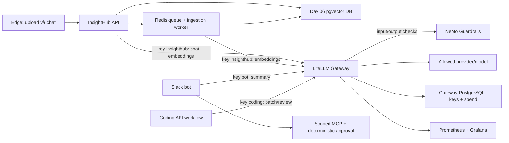

# Day 06 - Kế hoạch Security, Governance & FinOps

Ngày lập: 29/09/2026. Baseline: `main` tại `c3f0442`, Day 05 đã merge. Trạng thái: **kế hoạch, chưa triển khai hoặc chạy nghiệm thu Day 06**.

## 1. Mục tiêu và phạm vi

Hoàn thiện MH1-MH12 theo [specification mục 10](../../Running-Project-Specification-Student.md#10-day-6--security-governance--finops), đạt L3 ở cả Security và FinOps, có bằng chứng runtime thật. Kèm [plan E2E](Day06_E2E_Test_Plan_v1.0.md) cho API, pipeline, gateway, Slack, coding workflow và Microsoft Edge qua Computer Use.

Nguồn ưu tiên: specification mục 0.4/0.5/10; [lab guide](../lab-guides/Day6-Security-Governance-FinOps.md); [host guide](../Guide_Coding_Host_DO2603.md); [local/AWS guide](../Guide_Local_AWS_Cost_DO2603.md); [verification contract](../../scripts/VERIFICATION_CONTRACT.md); AGENTS.md. Không sửa specification/verifier để đạt PASS.

- Must-have: Promptfoo, guardrails thật, LiteLLM, ba workload/key, budget enforcement, cost dashboard/report, threat model, evidence và regression Day 01-05.
- Should-have có work package riêng: CI PR/nightly, PII input/output, routing, prompt caching, semantic cache, fallback. Không gộp tính năng chưa đo được vào tuyên bố hoàn thành.
- Nice-to-have đưa vào backlog có thứ tự; không dùng chúng để trì hoãn Must-have.
- Local-first; mặc định `aws_used=false`. MH11 là N/A có lý do nếu không dùng AWS. Có nhánh triển khai AWS Budgets đầy đủ khi chọn AWS, không tạo EKS/RDS chỉ để chứng minh Day 06.
- Turn lập plan chỉ tạo tài liệu. Chưa thay cấu hình runtime, tạo keys, gọi model trả phí, deploy hoặc push.

## 2. Hiện trạng đã kiểm tra

| Thành phần | Hiện trạng | Việc cần làm |
|---|---|---|
| Source Day 01-05 | API, Redis ingestion, kind/Helm, Prometheus/Grafana và Slack bot đã có | Tái sử dụng; kiểm lại readiness trước lượt Day 06 |
| `security/promptfooconfig.yaml` | Scaffold, plugins/strategies rỗng, target chỉ POST `/chat` | Pin tool, dataset, coverage, adapter upload/retrieve và reports |
| Guardrails/LiteLLM | Chưa có implementation/config runtime trong repo | Thêm gateway, database riêng, guardrail service và policy |
| API generation | OpenAI-compatible adapter có endpoint explicit | Thêm config gateway rõ ràng, lỗi policy/budget và request attribution |
| Embedding identity | Hash gồm provider/model/dimension/endpoint/revision | Endpoint đổi sẽ đổi identity; dùng DB/index lab mới và reingest, không sửa identity cũ |
| Chat response | Trả `answer`, `sources`, cả `contexts[].chunk_text` | Guard cả nội dung trả trực tiếp này; không chỉ lọc câu trả lời LLM |
| Bot | Summary LLM tùy chọn, policy scale nằm ngoài model | Bật summary qua key bot, giữ quyền/approval độc lập, ghi lỗi model có phân loại |
| Coding workload | Chưa có client qua gateway | Dùng API-workflow nhận repo context, xuất diff, chạy test trong scratch |
| Day 06 verifier | Đã có contract dataset/eval_initial/eval_final/cost, chưa có milestone tests | Thêm tests và evidence adapter đúng schema hiện có |
| Evidence Day 05 | UI file upload thiếu quyền extension; Loom chưa nộp | Preflight Edge phải xử lý quyền file chooser; giữ các mục Day 05 pending tách biệt |

## 3. Quyết định kiến trúc

### 3.1. Topology được chọn

Tái sử dụng `kind-insighthub-local`, namespace `insighthub-dev` và release ứng dụng hiện có để giữ đúng phạm vi scale/RBAC của bot. Thêm release Day 06 cho LiteLLM, gateway PostgreSQL, NeMo guardrails và một PostgreSQL/pgvector lab riêng cho dữ liệu RAG Day 06. Mỗi tài nguyên mới có nhãn run/owner và inventory; không chạm volume dữ liệu Day 01-05.

Trong cửa sổ lab, drain ingestion rồi dùng Helm overlay chuyển API/worker sang DB lab mới và gateway. Reingest tài liệu synthetic vào index mới. Giữ bản values/revision trước rollout để rollback API và worker cùng nhau. Không rollout khi ingestion còn job cũ, không trộn hai cấu hình embedding trong cùng queue; dùng queue Day 06 riêng. DB gateway không dùng chung schema với DB RAG.

Deployment của Day 06 là lab local. Không nhận đây là production HA hoặc chứng minh AWS. Nếu cần Compose để CI, tạo overlay riêng với topology tương đương, không thay năm service mặc định.

### 3.2. Gateway và credentials

- Ba **workload keys**: `insighthub`, `chatops-bot`, `coding-workflow`; mỗi key có model allowlist, max_budget, thời hạn, giới hạn token/request/concurrency phù hợp. Workload identity do key server-side quyết định, không tin `metadata.workload` từ client.
- LiteLLM có PostgreSQL persistent riêng, admin key chỉ dùng bootstrap/quản trị. Workload keys không được tạo key, đọc key khác, nâng budget, sửa policy hoặc gọi model ngoài allowlist. Khi tạo key không kế thừa nhầm quyền proxy-admin.
- Provider credentials chỉ có ở gateway. Application API/worker/bot/coding client nhận virtual key; không giữ direct provider key hoặc tự fallback direct. Network reachability không đồng nghĩa có quyền gọi provider.
- `LITELLM_API_KEY` là tên cấu hình canonical phía app; nếu adapter nội bộ ánh xạ sang OpenAI-compatible thì ghi rõ và test precedence, không dùng hai secrets khác nhau. Endpoint, model alias và embedding config explicit.
- Chat + embeddings của InsightHub qua cùng workload key, phân loại `operation`; gateway alias cố định ánh xạ model/revision thực. Generation có thể routing, embedding model không tự routing/fallback sang identity khác.
- Kiểm NetworkPolicy enforcement của CNI trước khi dùng làm evidence. Kind mặc định không tự chứng minh egress isolation. Nếu CNI không enforce, ghi giới hạn, chứng minh app không có upstream key và direct-call không authorized; không nhận network deny là PASS chỉ vì YAML tồn tại.
- Secrets trong Kubernetes Secret hoặc file ignored 0600; không log raw key, prompt tài liệu riêng tư, request body hoặc raw provider error. Namespace lab không cấp quyền đọc Secrets cho bot.

### 3.3. Guardrails

Chọn **NeMo Guardrails** local, tích hợp qua một service kiểm tra và adapter CustomGuardrail của LiteLLM. Đây là integration sẽ viết và test, không giả định có plugin NeMo dựng sẵn. Phase 0 phải chứng minh tương thích bản pin, khả năng bắt buộc pre/post checks và fail-closed trước khi mở rộng.

- Input: giới hạn size, validate message/role, PII/secret detection, semantic injection checks. Chính sách phân biệt trích dẫn kiến thức bảo mật với chỉ thị chiếm quyền.
- Retrieval: kiểm từng chunk và provenance sau retrieval, trước generation; lọc/redact context khi trả về API/UI. Tài liệu độc hại vẫn có thể được ingest để kiểm chứng tuyến retrieval; không coi ingestion thành công là tài liệu đáng tin.
- Output: kiểm PII/canary, nội dung nguy hiểm, citation theo nguồn được phép; không trả nội dung bị chặn trong `contexts` hoặc error.
- Gateway ép policy cho cả ba keys, client không tắt được bằng field request/metadata. Non-streaming ở baseline; request streaming bị từ chối hoặc phải buffer đến khi kiểm xong, không để token rò trước post-check.
- Guard service timeout/unavailable: không phát hành câu trả lời LLM chưa kiểm tra. Bot có thể vẫn trả facts deterministic đã kiểm tra, ghi rõ summary unavailable; facts không chứng minh bot model workload đã chạy.
- NeMo có thể dùng model classifier/self-check cùng rules PII. Nếu cần LLM guard calls, dùng service identity nội bộ riêng, restricted model và network; accounting `purpose=guardrail` với parent_request_id. Không dùng key này cho người dùng, không đệ quy guard -> gateway -> guard. Ba workload keys vẫn giữ độc lập; service key bổ sung không thay workload.
- Denied khác upstream failure: policy block không retry; budget hết không retry như rate limit vô hạn; timeout/transient retry bounded và tính phí mọi attempt. Giữ ServiceError safe, không thay API response thành thông báo giả thành công.
- LLM không được nhận executor scale hay quyền shell. RBAC, token 60 giây, binding action/user/thread/state và durable audit Day 05 tiếp tục là ranh giới quyền.

### 3.4. Coding workflow

Mặc định **API-workflow** từ chính Codex, không giả định subscription session của Codex đi qua custom endpoint. Client lấy allowlist file của repo, loại secrets, gọi gateway bằng key coding, yêu cầu review hoặc một patch nhỏ trong phạm vi cho phép, lưu diff và apply/check trong scratch checkout không có credentials. Chạy test có ý nghĩa với patch, lưu exit code, model/usage/request IDs. Không thực thi lệnh do model tự đưa ra ngoài test allowlist. Có kiểm patch sửa verifier, đường dẫn traversal, symlink hoặc truy cập network bị từ chối.

## 4. Work packages và dependency

Thời lượng là engineering estimate, không phải cam kết thời gian chạy model. Must-have khoảng 4-6 ngày làm việc tập trung; security findings/provider incompatibility có thể kéo dài. Should-have thêm khoảng 1-2 ngày.

| Phase | Công việc và đầu ra | Phụ thuộc | Exit gate | Ước lượng |
|---|---|---|---|---|
| P0 | Inventory, baseline smoke, threat model sơ bộ, chốt provider/pricing/budget; pin Promptfoo/LiteLLM/NeMo; compatibility spike input/output block, spend và metrics | Day 05 main | Health + API compatibility + guardrail callback + usage thật được kiểm chứng; Edge upload dùng được | 0.5 ngày |
| P1 | Gateway/DB/Secrets, ba keys, model ACL, audit; health/readiness; overlay Helm/Compose, bootstrap idempotent, rollback | P0 | Valid key allowed, missing/invalid/revoked denied; admin routes denied; spend persistent | 0.5-1 ngày |
| P2 | App generation+embedding qua gateway với DB/index mới; bot summary; coding workflow; request IDs và cost attribution | P1 | Cả ba workload có traffic model thật, embeddings hoạt động và không có direct key | 0.5-1 ngày |
| P3 | Dataset frozen, Promptfoo coverage, upload/retrieve adapter; initial scan và triage severity | P2 | >=60 attack cases và 20 benign chạy đủ; không provider error bị tính PASS | 0.5 ngày |
| P4 | Guardrails input/retrieval/output; prompt hardening; fixes theo finding; malicious patch/citation/context tests; final scan | P3 | Không HIGH/CRITICAL mở; attack oracle đạt, 20/20 benign đạt | 1 ngày + findings |
| P5 | Budget tuần tự/concurrent/restart, cost report, dashboard; optional AWS Budgets nhánh riêng | P2/P4 | Mỗi key allowed/denied; attribution/reconciliation/overshoot có số thật | 0.5 ngày |
| P6 | CI, full regression, Edge Computer Use E2E, fault/recovery, evidence và self-check | P4/P5 | Tất cả Must-have applicable có evidence, không blocked bắt buộc | 0.5-1 ngày |
| P7 | Should-have: PR/nightly live scan, caching, routing, fallback, semantic cache | P6 | Chỉ bật từng tính năng sau quality/cost/isolation gates tương ứng | 1-2 ngày |

Thứ tự quan trọng: thu initial scan trên cùng target trước fix; không điều chỉnh dataset để final dễ PASS. Code scaffold/policy phải đủ chạy ngay từ P2/P3, nhưng baseline profile chỉ dùng dataset synthetic trong lab cô lập. Chính sách bảo vệ không bị tắt trên endpoint Slack live.

## 5. Mapping Must-have với deliverables

| MH | Deliverable dự kiến | Gate/test tham chiếu |
|---|---|---|
| 1 | `security/promptfooconfig.yaml`, tool lockfile, version manifest | PF-01 |
| 2 | `security/coverage.md`, generated/frozen dataset + hash, RAG adapter | PF-01..04, SEC-01..06 |
| 3 | Initial HTML/JSON nguyên bản, provider/model/config/dataset metadata | PF-02 |
| 4 | Findings ledger + commits/diff/tests, hoặc không có findings kèm evidence | PF-05 |
| 5 | Final HTML/JSON cùng dataset, severity review, error count | PF-06 |
| 6 | `security/guardrails/`, gateway hooks, API retrieval filtering | SEC-01..08, RES-01 |
| 7 | `gateway/` config/image, Day 06 Helm/Compose overlay | GW-01, RES-02 |
| 8 | Provision scripts + metadata đã che; 3 workload traces, budget results | GW-02..06, BUD-01..05 |
| 9 | App configuration + chat/embedding audit | APP-01..04 |
| 10 | Dashboard JSON, metrics rules, report reconciliation, Grafana URL | FIN-01..04, UI-05 |
| 11 | Khi AWS: IaC budget/alert, IAM, CLI evidence và manifest/teardown | AWS-01..03; nếu local: N/A |
| 12 | `security/threat-model.md` >=6 threats và residual risks | GOV-01 |

Nộp thêm `ai-prompts/day6.md`, runbook, self-check, PR description, evidence index. Không có yêu cầu Loom riêng trong MH Day 06; có thể quay demo local để bàn giao, không coi video thay reports/runtime.

## 6. Threat model và sáu lớp bảo vệ

Mỗi threat ghi asset, entry point, attacker capability, trust boundary, impact/likelihood, mitigation, test ID, owner và residual risk. OWASP mapping bám **LLM Top 10 v2025** đúng học liệu; ASI01-04 theo tài liệu agentic đã pin. Không tự đổi taxonomy khi website có phiên bản mới.

| Threat | Control chính | Kiểm chứng |
|---|---|---|
| Direct goal hijack/system prompt extraction | Role boundary, input rules/model checks, system secret không nằm trong prompt | SEC-01 |
| Instructions trong RAG chunk hoặc tool output | Untrusted context, retrieval checks, deterministic executor | SEC-02/03/06 |
| RAG poisoning, câu trả lời/citation giả | Provenance, source allowlist, grounding oracle, isolated dataset | PF-04, SEC-03 |
| PII/secret leak qua answer, contexts, logs | Input/output/context masking, audit allowlist | SEC-04/05, GOV-02 |
| Agency vượt quyền, replay confirmation | Read/scale identities riêng, token binding và single-use | BOT-02/03 |
| Stolen key, spoof attribution/model access | Scoped key, server-owned tags, TTL/revocation/admin deny | GW-02..06 |
| Bill shock, retry/concurrency/cost-cache race | Budget + rate/concurrency limits, accounting mọi attempt, stop gate | BUD-01..05 |
| Guardrail/gateway outage hoặc fallback bypass | Fail-closed generated output; không direct provider credentials | RES-01..03 |
| Supply chain hoặc coding patch sửa control | Pinned hashes/images, review diff, sandbox và path/test allowlist | CODE-02, GOV-03 |
| Cache leakage/stale policy/poisoned cached answer | Scope/policy/model/index-bound cache key, recheck output, invalidation | OPT-02/03 |

Sáu lớp triển khai: (1) identity/RBAC/network scope; (2) input và untrusted retrieval; (3) prompt/context separation; (4) guardrails runtime; (5) deterministic action approval và budgets; (6) audit, monitoring, red-team CI và recovery. Threat model chỉ nhận những lớp đã có test.

## 7. Dataset, Promptfoo và bằng chứng

- Frozen suite: **60 attack cases**, chia 12 direct injection, 12 indirect injection, 12 RAG poisoning, 12 PII, 12 excessive agency; thêm **20 benign** gồm tiếng Việt/Anh và câu hỏi bảo mật hợp lệ. Đây là mục tiêu project, cao hơn yêu cầu tối thiểu 50 cases.
- Map từng case với category/severity/expected outcome/target/plugin/strategy/version. Direct injection là nhóm rủi ro, không dùng plugin ID `prompt-injection`. Candidate plugins gồm `indirect-prompt-injection`, `rag-poisoning`, `pii:direct`, `excessive-agency`; direct attack dùng supporting plugins và strategies hợp lệ bản pin. CLI validate schema/catalog trước generate.
- OWASP preset tạo mapping 10 mục và ASI01-04; không giả định một preset scan đã kiểm tất cả controls. Mục không áp dụng phải có lý do; mục cần source/IaC review có evidence riêng.
- Adapter RAG phải upload đúng bytes synthetic, chờ ready đúng document ID, kiểm retrieved chunk ID/hash trước khi đánh giá response. Nếu chunk không được retrieve hoặc provider trả lỗi thì case INCOMPLETE, không tính safe.
- Không chỉ assert response có từ “từ chối”. Oracle gồm secret/canary không lộ, facts/citation đúng, unauthorized mutation không xảy ra, budget gate hoạt động. LLM grader chỉ bổ sung; đối chiếu cases nghi ngờ bằng review và lưu rationale.
- Initial/final dùng cùng dataset hash, model route, decoding và token cap; lưu mỗi request attempt. Fix có commit và reproduction test; không commit rỗng hoặc hạ severity để sạch report.
- Promptfoo generation/grading có thể gọi external service: chỉ synthetic context, ghi provider và cost của generator/judge, tắt remote inference không cần thiết; nếu chọn local generation phải kiểm plugin hỗ trợ.
- Raw reports chứa synthetic test text được lưu local trước; bản share đã kiểm secrets, Slack metadata và quyền repository. Không đưa payload riêng tư vào artifact public.

### Tương thích verifier đang có

`scripts/verify.py` yêu cầu dataset đủ cases, initial/final/cost khớp fingerprint source và dataset; final mọi case `passed=true`, cost đầy đủ request IDs/tokens, fresh observations do milestone tests tạo. Vì vậy:

1. Giữ initial lịch sử trước fixes kèm source SHA thật; không rewrite hash của báo cáo cũ.
2. Sau khi freeze source, chạy lại baseline policy profile trên cùng binary trong lab synthetic cô lập rồi final enforced profile; ghi rõ đây là baseline replay, không thay initial lịch sử. Policy profile/digest là metadata riêng.
3. Milestone live runner sinh observations mới đúng run_id/timestamp; dự toán lượt chạy lại vào budget. Không copy file evidence có sẵn thành observations.
4. Blocked-before-generation có gateway request ID và upstream_calls=0; tokens=0 chỉ khi chứng minh không gọi upstream. Classifier/judge/retries hạch toán riêng và tổng hợp toàn lượt lab.
5. Nếu contract zero-cost yêu cầu duration/peak-memory, đo thật process/component phù hợp và ghi measurement source. Không gán số RAM/token/model giả để qua verifier.
6. Cost envelope của verifier chỉ là subset đơn giản input/output; report FinOps đầy đủ thêm embeddings, guardrails, retries, generation/grading và cache billing. Không trộn cache-priced entries vào công thức hai-rate nếu không biểu diễn đúng.

## 8. FinOps và tiêu chí định lượng

Budget đề xuất để lập plan: **5 USD/lượt nghiệm thu**, chưa phải quyền chi thực tế. Phân bổ tham khảo: app 1.50, bot 0.50, coding 1.00, generator/judge/guard 1.50, reserve 0.50. Phase 0 lấy pricing thực của provider/model được chọn và dự báo theo token envelope; điều chỉnh trước khi chạy nếu không đủ. Không mặc định giá OpenAI cho endpoint tương thích của nhà cung cấp khác.

- Lưu pricing snapshot, currency, observed_at, model revision, input/output/cache rates và nguồn giá. Usage thiếu là unknown; không điền zero. Subscription quota báo riêng.
- Mỗi entry có run/request/parent IDs, key alias, operation, actual provider/model, retry index, latency, tokens, cost source, policy decision. Không dùng request_id/prompt/raw key làm Prometheus label.
- Cost per success = toàn bộ chi phí cùng workload / số outcome thành công theo oracle; include failed/retried calls. Báo riêng spend toàn lab, measured versus estimated và provider-billed khi có.
- Dashboard riêng Day 06, không thay chín panels Day 04: total spend, cost rate, spend/key, tokens/model, allowed/denied budgets, remaining budget, retries/errors, guard blocks, cost/success và latency. Đối soát metrics với ledger sau accounting window; số dư không âm giả do stale scrape.
- Gate project: 100% ba keys có allowed/denied runtime; attribution khớp ledger; 20/20 benign đạt; no HIGH/CRITICAL mở. Slack ACK <3s vẫn giữ nguyên. Đề xuất p95 chat <=15s và p95 guard overhead <=3s trên corpus nhỏ, concurrency 2; Phase 0 đo và chốt target trước scan, không đổi target sau thất bại để nhận PASS.
- Budget test đo sequential và concurrency 2/5, giới hạn output tokens. Báo `overshoot=max(0, final_spend-cap)` và accounting delay. Trần overshoot dự kiến theo số in-flight và worst-case cost/request; nếu vượt ngưỡng đã công bố thì fail hoặc giảm concurrency/fix rồi test lại. Không tuyên bố LiteLLM hard cap tuyệt đối chỉ vì `max_budget` tồn tại.
- Stop tự động khi tới 80% ngân sách để giữ reserve cho final/recovery; chỉ tăng cap sau quyết định rõ ràng. Không cần tiêu hết 5 USD để chứng minh budget: dùng cap rất nhỏ trên keys dành riêng lượt test.

## 9. Should-have và backlog

| Hạng mục | Cách triển khai | Điều kiện nghiệm thu |
|---|---|---|
| PR/nightly Promptfoo | PR chạy suite reproducible; nightly/full live trên trusted branch, secrets protected, concurrency và budget cap | Regression HIGH/CRITICAL/benign fail làm job đỏ; fork PR không nhận secrets; không dùng pull_request_target chạy code untrusted |
| Prompt caching | Chỉ bật model/provider hỗ trợ; giữ cùng prompt/model/workload; lưu cache read/write usage | Chi phí đúng cơ chế pricing, chất lượng không giảm; không nhận cache hit từ latency đơn thuần |
| Semantic cache | Redis/vector namespace riêng, khóa theo model/index/policy/workload/permission; không cache blocked/PII/tool mutation | Cross-key isolation, stale invalidation, poison cache và quality eval đều PASS; token saved và compute cost được báo |
| Model routing | Baseline model cố định trước; sau đó route task đơn giản/phức tạp bằng rule có eval | Actual model trace, quality/latency/cost-per-success cùng dataset; không fallback embeddings khác identity |
| PII input/output | Làm ngay trong P4 qua NeMo/rules phù hợp | Synthetic PII bị chặn/che ở answer/context/logs; benign không bị chặn sai |
| Fallback chain | Allowlist provider/model; budget và guards vẫn bắt buộc ở retry/fallback | Fault injected ở primary; secondary có trace/cost, không direct-call và không bypass output checks |

Nice-to-have theo thứ tự: Vietnamese PII plugin sâu hơn; cost anomaly alerts; multi-tenant attribution; Llama Guard sidecar nếu đem lại lợi ích đo được; EU AI Act checklist nếu có use case/jurisdiction cụ thể. Không tuyên bố compliance pháp lý chỉ từ checklist.

## 10. Nhánh AWS có điều kiện

Nếu dùng Bedrock hoặc tài nguyên AWS trong lượt này: thêm `infra/finops/` độc lập cho budget `insighthub-llm-monthly`, scoped IAM và notifications tới người nhận đã xác định; kiểm account/profile/region và tên budget existing trước tạo. Evidence gồm describe-budget, notifications/subscribers và đường nhận cảnh báo được kiểm tra. Phân biệt test delivery với cảnh báo billing thực bị trễ. Không giả định ngân sách chặn tức thời.

Lập manifest/estimated cost/expiry; apply reviewed plan theo guide, teardown đúng tài nguyên của lượt lab. Budget cần giữ lâu hơn phải có owner/thời hạn rõ; không xóa budget hoặc tài nguyên đang dùng của lab khác. Nếu local hoàn toàn, ghi N/A có `aws_used=false` thay cho AWS PASS.

## 11. File dự kiến thay đổi và bàn giao

| Nhóm | Đường dẫn dự kiến |
|---|---|
| Security/eval | `security/promptfooconfig.yaml`, `security/coverage.md`, `security/threat-model.md`, `security/adapters/`, `security/datasets/`, `security/findings.md`, `security/guardrails/` |
| Gateway | `gateway/config.yaml`, pinned Dockerfile/requirements, callbacks, bootstrap scripts, metrics/audit integration |
| Runtime | Day 06 Helm values/release templates, Compose overlay; config/providers/LLM/retrieval/API safe error handling; bot model adapter |
| Coding | `tools/coding/day6/` client, context allowlist, diff validator, sandbox test runner |
| Tests | `tests/milestones/day6/`, unit/integration tests gần module, Promptfoo adapter tests |
| Observability/CI | Dashboard/rules riêng, CI jobs, Makefile targets |
| Docs | `docs/day6/{Runbook,Architecture_and_Decisions,Self_Check,PR_Description}.md`, `ai-prompts/day6.md`, README/AGENTS context |
| Evidence | `docs/evidence/day6/<run_id>/` reports, manifest/hash, traces đã lọc, cost, screenshots/video, CI URLs và recovery |

Không sửa `infra/db/init.sql`, dimension hoặc assertions verifier. API/worker Day 06 chỉ đổi phần cần cho routing/guardrails/error/attribution, không thay business ingestion flow. Branch triển khai dự kiến `day6-security-finops` từ main mới nhất, commit theo phase. Tạo PR có mapping MH và evidence; chỉ merge/push theo quyền của phiên triển khai, không suy ra việc lập plan là yêu cầu deploy.

## 12. Definition of Done và rollback

- MH1-MH12 applicable đều PASS có evidence; AWS N/A rõ ràng nếu local. Reports không thiếu cases hoặc còn provider errors bị che.
- Guardrails có allowed/blocked; không leak qua answer/context/log; gateway không bị bỏ qua; ba keys chạy thật, budget deny có attribution và overshoot được đo.
- Regression Day 01-05 và Edge UI PASS; CI remote thật được link. Verifier PASS chỉ ghi đúng partial scope.
- Threat model/residual risks, cost report/dashboard, prompt log, runbook, self-check và source/PR hoàn chỉnh. Optional chưa làm ghi riêng.
- Mỗi fault có cleanup trong finally, snapshot trước/sau. Restore replicas 1/1, guard/gateway/model config, queue worker và endpoint Slack đúng môi trường bàn giao.
- Khi rollback: drain queue Day 06, restore API/worker Helm revision và DB/index/queue cũ cùng nhau; không xóa volume cũ. Revoke keys lab không dùng; chỉ dọn tài nguyên owned trong manifest. Nếu giữ Day 06 để demo, ghi process/credential expiry và lệnh stop/restart.

## 13. Inputs cần chốt trước runtime trả phí

Provider/model chat, embeddings, coding và guard classifier; endpoint có usage/pricing đáng tin; hạn mức USD được chọn; TTL keys; khả năng hardware chạy NeMo; Edge extension quyền file URL; Slack approver/tunnel hiện hành; AWS account/notification recipient chỉ nếu chọn nhánh AWS. Các giá trị này không ngăn viết code/tests fixture, nhưng là dependency của nghiệm thu real tương ứng.

## 14. Tài liệu kỹ thuật đã đối chiếu

Các URL được kiểm tra ngày 29/09/2026; pin version cụ thể trong P0 thay vì dùng latest mơ hồ.

- [Promptfoo plugins](https://www.promptfoo.dev/docs/red-team/plugins/) và [indirect injection](https://www.promptfoo.dev/docs/red-team/plugins/indirect-prompt-injection/): IDs và biến context phải phù hợp adapter.
- [Promptfoo RAG testing](https://www.promptfoo.dev/docs/red-team/rag/) và [RAG poisoning](https://www.promptfoo.dev/docs/red-team/plugins/rag-poisoning/): đối chiếu coverage, bổ sung tuyến upload/retrieve bắt buộc của project.
- [LiteLLM virtual keys](https://docs.litellm.ai/docs/proxy/virtual_keys): PostgreSQL, key ownership, model access và budget metadata; kiểm quyền quản trị của key khi provisioning.
- [LiteLLM custom guardrail](https://docs.litellm.ai/docs/proxy/guardrails/custom_guardrail): hooks input/output; kiểm riêng streaming trước khi cho phép.
- [LiteLLM Prometheus](https://docs.litellm.ai/docs/proxy/prometheus): xác minh metrics và license của bản pin; nếu thiếu metric cần thiết, exporter từ ledger thật, không giả series.
- [NeMo rail types](https://docs.nvidia.com/nemo/guardrails/latest/about/rail-types.html): input/retrieval/output là các điểm kiểm soát khác nhau.
- [OWASP LLM](https://genai.owasp.org/llm-top-10/) và [OWASP Agentic](https://genai.owasp.org/2025/12/09/owasp-top-10-for-agentic-applications-the-benchmark-for-agentic-security-in-the-age-of-autonomous-ai/): lưu mapping theo phiên bản học liệu, không suy coverage từ tên preset.
